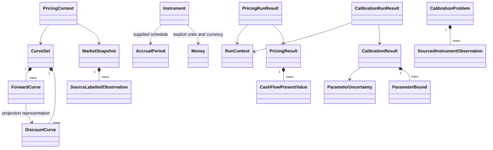

# Domain relationships and financial ownership

Contracts describe payments owed; snapshots describe what is known; curves describe
discounting/projection assumptions; results preserve the evidence tying them together.
These are separate values because changing a model curve should not change the
observed fixing or the contractual obligation.

`SourceLabelledObservation` and `Instrument` summarize several concrete types in the
diagram; they are not additional instantiated classes. MarketSnapshot owns tuples of
quotes/rates/FX/volatility/credit/fixings. CurveSet owns unique discount and index
projection assignments and rejects a CurveId reused for inconsistent contents.

CashFlow/FixedRateCashFlow/FloatingRateCashFlow use signed notionals/amounts. Bond
face, swap notional and FX base notional are nonnegative; explicit directions create
the signs of exchanged payments. AccrualPeriod separates accrual from payment dates
because lagged payments change discounting. An index name identifies the required
fixing/projection convention; the code does not fabricate an official market index.

PricingResult owns original signed amounts, reporting-currency contributions and
input hashes. RunContext identifies a workflow/configuration; it is not a persisted
risk job, model approval or random generator. Nominal IDs such as CounterpartyId
are types, not proof of a counterparty/portfolio aggregate.

Trade, Portfolio, NettingSet, CSA, CollateralAccount, Simulation, ExposureProfile,
XVAResult, Finding and persisted model-governance aggregates are NOT IMPLEMENTED.
See [roadmap](../ROADMAP.md), [code locations](CODEBASE_GUIDE.md) and
[limitations](LIMITATIONS.md).

SourcedInstrumentObservation summarizes DiscountObservation, BondOptionObservation
and CallObservation; it is not another concrete class. CalibrationProblem is a protocol
implemented by three immutable Q-model objectives. Premium inputs are separate from
MarketSnapshot volatility observations. CalibrationResult owns bounds/fitted values,
predictions/residuals/status/hashes and ParameterUncertainty; the application wraps
it with RunContext. It is not a persisted calibration job or an approval.

Vasicek/HullWhite/GeometricBrownianMotion/Heston implement finite coefficient
contracts; state is an immutable tuple, not a path aggregate. CorrelationMatrix owns
factor order and values. CorrelationRepair preserves the explicitly requested
transformation evidence. See [model contracts](methodology/STOCHASTIC_PROCESSES.md)
and [calibration](methodology/CALIBRATION.md).
