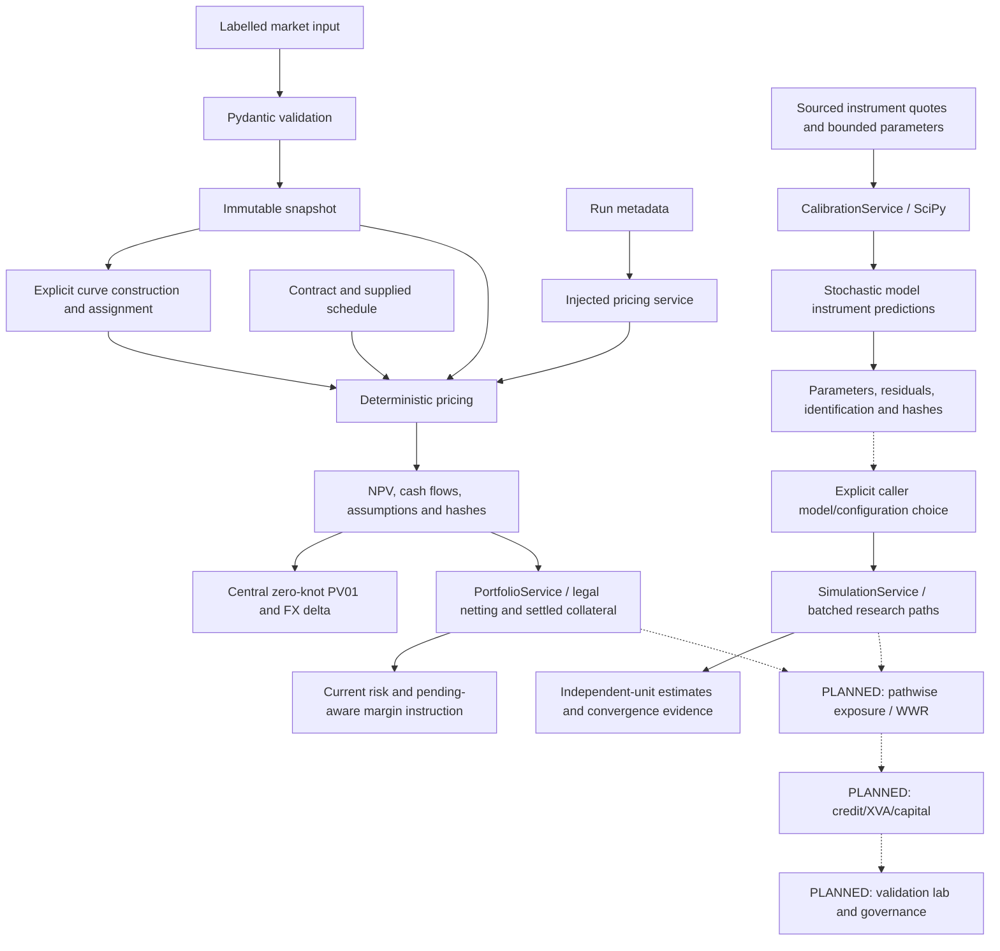

# Implemented and planned workflow

| Implemented step | Input / transformation / output | Module and failure |
|---|---|---|
| Ingestion | JSON with explicit dates, values and provenance → checks → immutable snapshot | application/market_data + domain/market; malformed/duplicate/missing metadata errors |
| Curves | Explicit knots/quotes, conventions and assignments → interpolation/bootstrap → discount/projection curves | domain/market/curves; invalid anchor/horizon/root/residual errors |
| Contracts | Money + supplied schedules/day counts/directions → checks → typed instrument | domain/instruments; invalid schedule/notional/convention errors |
| Run orchestration | Context + instrument + frozen run envelope → safe logs/injected engine → run-linked result | application/pricing; propagates authored errors |
| Pricing | Future signed payments → historical fixing or projected rate → discounted PV contributions | domain/pricing; missing fixing/index/currency/FX or numerical failure |
| Sensitivity | Explicit curve IDs/spot bumps → immutable up/down revaluation → central derivative/evidence | domain/pricing/sensitivities; invalid/resolution/range failure |
| Calibration | Sourced premiums + explicit model/bounds/scales → injected bounded optimizer → convergence/parameters/uncertainty/evidence | application/calibration + infrastructure/calibration + domain models/objectives; explicit failures |
| Model step | Finite state/time/independent shocks → chosen exact or numerical scheme → next state | domain/models; no RNG, invalid states/proposals fail, Heston projection is reported |

See [code call path](CODEBASE_GUIDE.md) and [pricing workflow](workflows/PRICING_WORKFLOW.md).
See [calibration workflow](workflows/CALIBRATION_WORKFLOW.md) and
[simulation workflow](workflows/SIMULATION_WORKFLOW.md). Future arrows describe
intended phases. No stochastic exposure profile, XVA, capital or governance
result exists today. Phase 5 implements deterministic portfolio results.

Phase 4: explicit typed simulation configuration + RunContext → owned addressed
normal stream → corrected Gaussian driver covariance → selected vectorized kernels
→ immutable path batches → observable → independent-unit moments/inference and
convergence evidence. Single Sobol designs record absent IID inference; independent
scramblings provide valid sampling units. Separate control pilots are never implicitly
fitted on the evaluation stream.

Phase 5: immutable book + matching PricingContext + complete scoped cash ledgers +
RunContext → injected pricer/lineage validation → within-set gross/net value → settled
collateral residual/current risk and pending-aware instruction → positive/negative set
risk sums across legal entities. A separate deterministic MPOR scenario freezes settled
physical cash and values it at caller-supplied closeout. See
[portfolio workflow](workflows/PORTFOLIO_WORKFLOW.md).
