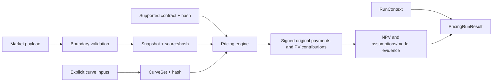

# Data and evidence flow

Source-labelled JSON → MarketSnapshotInput → frozen MarketSnapshot. Supplied curve
conventions/knots or supported bootstrap quotes → immutable curves → CurveSet.
Contract/schedule + PricingContext → DiscountingEngine → signed cash-flow PVs and
PricingResult. PricingService attaches RunContext and safe outcome logs.

Observations remain distinct from derived curves: an index fixing records a known
rate, whereas a projection curve supplies a future implied rate. A bump creates new
curve/snapshot values, so base/up/down evidence can identify changed inputs.

Concrete mapping and failure conditions: [workflow](../WORKFLOW.md) and
[pricing call path](../workflows/PRICING_WORKFLOW.md). There is no database write of
these results, automatic portfolio ownership or persisted calibration/governance lineage.

CalibrationRequest → sourced immutable objective/bounds/settings → CalibrationService
with injected ScipyLeastSquares → model predictions and scaled residual optimization
→ CalibrationResult/ParameterUncertainty → run-linked CalibrationRunResult. Quote order,
units, signed residuals, IDs and data/settings hashes remain explicit. This evidence is
in memory/JSON, without persistence. See [calibration path](../workflows/CALIBRATION_WORKFLOW.md).

SimulationRequest + explicit model/unit/measure/sequence/grid/correlation → owned
NormalStream → per-step Gaussian innovation covariance → vectorized transition
→ immutable batch → injected observable → descriptive moments and independent-unit
Estimate or explicit absence → RunContext/SimulationMetadata/result evidence.
Independent Sobol replicates and separate pilot controls retain their own addresses.
No research-result database writes or portfolio/exposure aggregation occurs.
