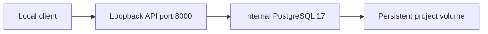

# Current deployment topology

Normal Compose runs API and PostgreSQL 17 on a private project network. Only API
loopback port 8000 is published. PostgreSQL uses a named persistent volume; it is
not published in normal deployment. The multi-stage Python 3.12 image runs as
non-root UID 10001, installs a wheel/runtime lock and checks readiness for health.

The verification override uses loopback API 58000 and DB 55432 under a separate
phase-specific Compose project. Those volumes are disposable test data; the normal
project's volume is retained. [Docker operations](../operations/DOCKER.md) explains
ownership checks and cleanup. CI uses its own `parallax-risk-ci` stack and teardown.

This is local research deployment, not a hardened production financial service.
Authentication, financial jobs, scale/HA and release hardening are DEFERRED to Phase 12.

Phase 5 adds pure Python book/collateral functionality within the existing wheel.
No additional service, port or persistent volume is needed. The active disposable
verification project is parallax-risk-phase6-verification; normal database data
and other projects remain outside its cleanup scope.

Phase 6: Pure Python exposure/credit runs in the existing wheel, with no new service/port/data volume. The active disposable verification project is parallax-risk-phase6-verification; normal project data and other workloads remain outside cleanup.
See [exposure workflow](../workflows/EXPOSURE_WORKFLOW.md).
