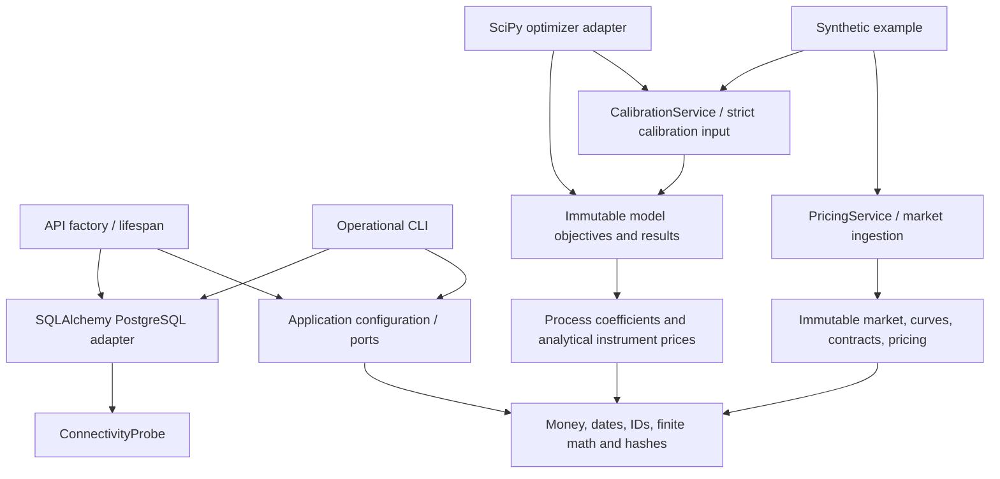

# Architecture overview

Parallax Risk uses one typed src-layout package with explicit composition. The
current domain includes pricing, model coefficients and calibration objectives, with
mathematical tests independent of HTTP/ORM.

`create_app()` and CLI `main()` own operational dependency lifetimes. `PricingService`
injects engine/logger and returns run-correlated evidence. The pricing library has
no environment/database requirement. `common` logging is isolated and configures no
global logger on import. All package imports are tested for side effects.

CalibrationService injects the CalibrationSolver port/logger. ScipyLeastSquares is
an infrastructure optimizer adapter; immutable objectives and numerical instrument
formulas stay in domain. NumPy/SciPy math dependencies are permitted there; domain
still imports no application, adapter, Pydantic, HTTP or ORM code. Models generate
no random state, paths or import-time IO.

See [components](COMPONENTS.md), [data flow](DATA_FLOW.md),
[dependency rules](DEPENDENCY_RULES.md), [deployment](DEPLOYMENT.md) and the
[historical foundation explanation](foundation.md). Rationale and per-phase changes
are in [decisions](../decisions/README.md), not proof of institutional approval.
