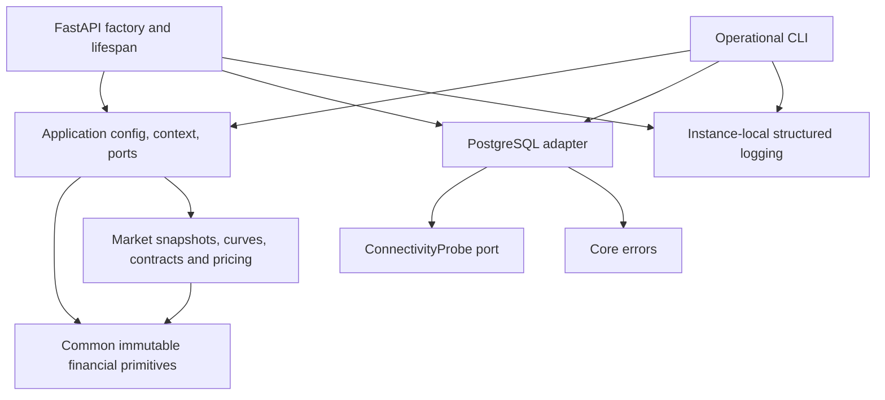

# Parallax Risk foundation architecture

Phases 1–2 use a modular Python package with inward dependencies. Deterministic
domain pricing is implemented; future-phase directories are not scaffolded.
The package has no import-time
IO, environment reads, network connections, resource creation or global logger
configuration. Python module metadata and immutable type definitions are allowed.

`common` owns nominal IDs, exact decimal Money, finite scalar operations, civil
date/time and calendar conventions, tolerance and error contracts. It does not
import Pydantic, SQLAlchemy or FastAPI. Logging is an isolated cross-cutting module
using structlog; no quantitative primitive depends on it.

`application` owns Pydantic configuration at a boundary, canonical configuration
hashing, immutable RunContext and the connectivity protocol. Phase 2 adds frozen
Pydantic market ingestion and an injected pricing workflow returning run-correlated
domain results. It does not import ORM or HTTP types.

`domain` owns immutable market observations/snapshots, curve representations,
bounded deterministic bootstrap, contracts, valuation evidence and sensitivities.
It depends only on common primitives and Python standard-library arithmetic,
never Pydantic, HTTP, ORM or application types. Curve construction and pricing
are explicit calls with no process-global caches. Source-labelled observations
remain separate from derived curves; the result hashes both. The bootstrap quote
protocol describes extension points, while Phase 2 supports deposits and par swaps.
Floating cash-flow abstraction supports the implemented simple-index contract;
future stochastic or compounded logic is absent.

`infrastructure.persistence` adapts SQLAlchemy to the connectivity protocol. An
engine is constructed explicitly at CLI invocation or API lifespan startup, with
lazy connections, finite pool limits, and connect/statement timeouts. SELECT 1
is its only query. Exceptions are sanitized at this adapter; no tables exist.

`api` and `cli` are composition roots and own the lifetime of injected probes.
Readiness probes run in a thread pool so synchronous PostgreSQL calls cannot
block the event loop. Liveness does not depend on external availability. Missing
database configuration is visible as 503, never a false healthy persistence claim.

Imports and layer contracts have automated tests. Logs contain restricted event,
outcome, error-type and optional run-ID fields, without raw portfolio/market data
or connection strings. Later phases must review sensitivity before adding fields.

The service is intentionally unauthenticated with only operational endpoints;
financial API workflows and security hardening belong to Phase 12. Expose this
baseline only on loopback/development networks. PostgreSQL is not published by
Compose. The non-root container has no source mounting or automatic migrations.

The ADRs record accepted implementation choices, not external institutional
approval. Architecture, numerical correctness and regulatory compliance must not
be inferred solely from the project title.
