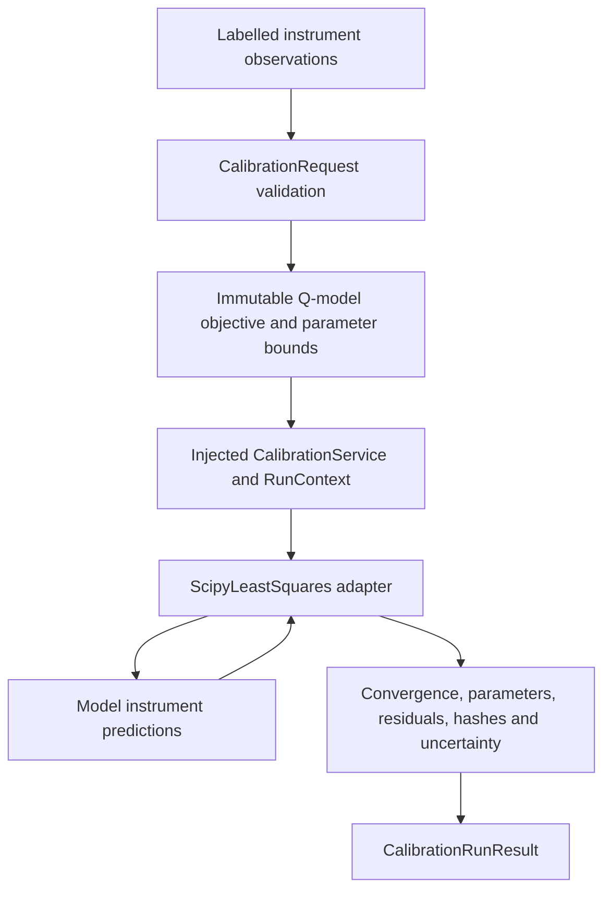

# Calibration workflow

Intuition: sourced observations become a model fit, and the result records enough
evidence to distinguish changed inputs from changed solver settings or parameters.

| Step | Why / input → output | Code / failure |
|---|---|---|
| Strict ingestion | Discriminated request avoids model guessing; JSON numbers/source/as-of → validated payload | `src/parallax_risk/application/calibration_inputs.py`; Pydantic invalid type/extra/model failures |
| Domain conversion | Separate premiums from raw vol quotes; validated payload → immutable sourced objective/bounds/settings/ID | `src/parallax_risk/domain/calibration/problems.py`; invalid quotes/time/currency/arbitrage/domain |
| Orchestration | Tie numerical evidence to caller's run/config; explicit values → safe start/outcome logs | `src/parallax_risk/application/calibration.py`; errors logged and propagated |
| Optimization | Fit bounded Q parameters; predictions/observations/scales → local least-squares solution | `src/parallax_risk/infrastructure/calibration/scipy_solver.py`; evaluation error or explicit FAILED status |
| Instrument math | Analytical bonds/bond calls or Fourier equity calls → finite model values | `src/parallax_risk/domain/models/`; NumericalError when arithmetic/integration gate fails |
| Identification | Jacobian SVD/residuals/bounds → local covariance or reason for absence | ScipyLeastSquares; no automatic model approval |
| Result | Preserve original order, signed errors and metadata → CalibrationRunResult | contracts/service; `require_converged()` is explicit caller policy |

Run `python scripts/demo_calibration.py`. Its three synthetic fits do not call an
API, database, vendor or random engine. Financial HTTP/CLI jobs remain Phase 12.
See [methodology](../methodology/CALIBRATION.md), [code guide](../CODEBASE_GUIDE.md),
[reproduction](../REPRODUCIBILITY.md) and [tutorial](../tutorials/02-FIRST-CALIBRATION-RUN.md).
